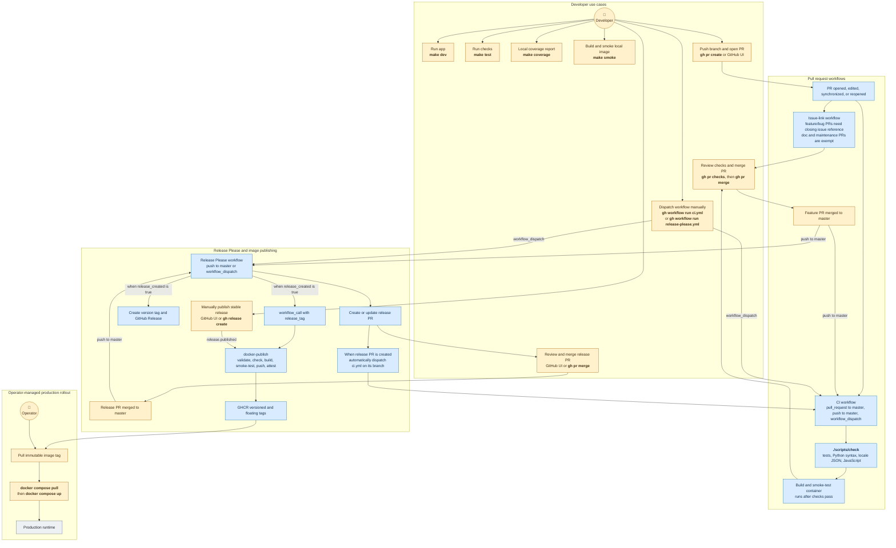
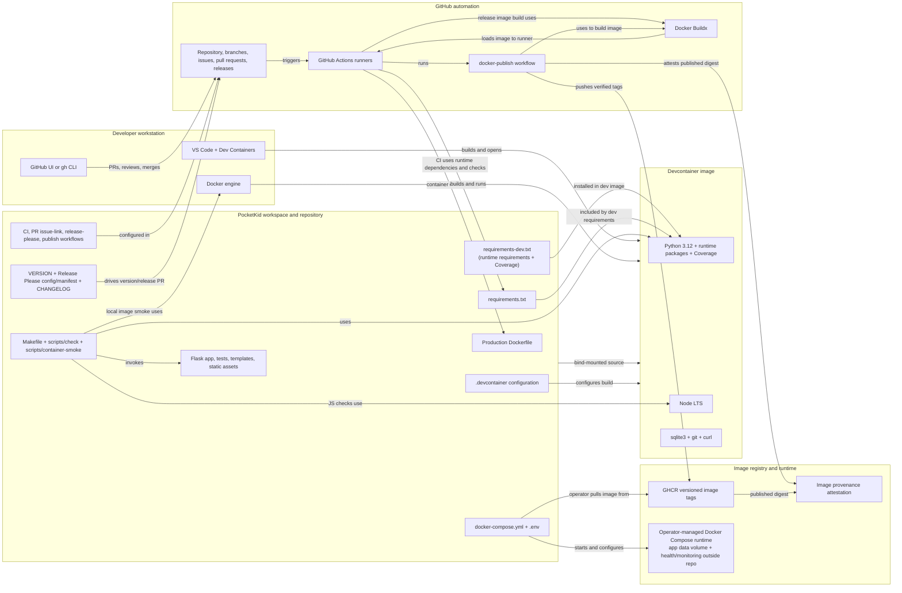

# PocketKid development and release workflow

This document defines the target workflow for PocketKid so that local development stays simple while validation, PR checks, and production image publication remain reliable and repeatable.

## Goals

- Keep local development in a single, reproducible environment: the devcontainer.
- Use GitHub as the source of truth for validation and release automation.
- Keep the local command surface minimal.
- Make every production image proven before publishing.
- Favor a lean automation model over custom workflow complexity.

## Core principle

The project should be developed in the devcontainer, and all important gates should live in GitHub Actions.

Developers should not need a complex local toolchain or custom shell orchestration just to validate a branch.

## Split of concerns

Use GitHub for:

- pull request and release validation
- release images in GHCR
- provenance-backed image publishing

Keep local Docker builds for:

- development
- debugging
- quick smoke validation

This separation keeps the feedback loop short for developers while keeping the release artifact authoritative, tested, and provenance-backed.

## Workflow use cases and triggers

This view distinguishes manually initiated actions from automation. `make` commands run in the devcontainer; `gh` commands require an authenticated CLI environment or can be done in the GitHub UI. Production rollout is operator-managed.



**Legend:**

- Gold nodes are manually initiated.
- Blue nodes run automatically after their labeled event.
- Gray nodes are resulting environments.

Manual actions are the listed `make`, authenticated `gh`, and `docker compose` commands or GitHub UI operations. Automatic triggers are PR events, pushes to `master`, `workflow_dispatch`, and release creation. Release Please uses its default `GITHUB_TOKEN`; GitHub suppresses a new workflow run for the resulting `release.published` event, so `workflow_call` is the publishing path for a Release Please release. A manually published stable release triggers the `release.published` path. If Release Please is changed to use a PAT or GitHub App token, both publishing paths can run; the concurrency group serializes runs but does not deduplicate them. Coverage is a local report only; CI and release workflows do not enforce a coverage threshold. The issue-link workflow is a separate PR gate.

## Component view

This view shows the components and dependencies used to develop, test, build, publish, and run PocketKid. Arrows represent dependencies or connections, not workflow order.



The development image contains developer tooling; the production image continues to install only `requirements.txt`. GitHub publishes verified images to GHCR but does not deploy them to the production runtime.

---

## Local development model

### Supported development environment

Use the devcontainer as the only supported local workspace.

This is already defined in [.devcontainer/devcontainer.json](../.devcontainer/devcontainer.json).

### Standard local commands

Run these commands in the devcontainer:

```bash
make dev
make test
make coverage
make smoke
```

Coverage is an informational local report; CI does not enforce a coverage threshold.
The equivalent direct commands are:

```bash
python app.py
./scripts/check
python -m coverage run --source=pocketkid -m unittest discover -s tests
python -m coverage report -m
./scripts/container-smoke --build
```

The project should avoid introducing extra local tooling unless it materially reduces friction.

---

## Pull request flow

### Developer workflow

1. Create a branch from `master`.
2. Work in the devcontainer.
3. Run the local checks before pushing.
4. Open the PR with GitHub CLI when ready:

```bash
gh pr create --fill
```

1. Use `gh` to review the checks and merge when green:

```bash
gh pr checks
gh pr merge --squash --delete-branch
```

### Branch protection expectations

Pull requests should require:

- successful CI validation
- no failing required checks
- branch up-to-date status before merge if the repo enforces it

### CI behavior

On PRs targeting `master`, GitHub Actions should run:

- Python unit tests
- Python syntax validation
- JSON validation for locale files
- JavaScript syntax validation
- Docker image build
- container smoke test

This is already implemented by [ci.yml](../.github/workflows/ci.yml).

---

## Release and versioning model

Use `release-please` for release PRs and semantic version bumps.

This keeps versioning and changelog generation automated without requiring manual edits to `VERSION` in normal feature PRs.

The current release automation is defined in [release-please.yml](../.github/workflows/release-please.yml) and [release-please-config.json](../release-please-config.json).

### Release policy

- feature PRs do not directly edit `VERSION`
- release PRs are created by release-please
- merge of the release PR creates the GitHub Release and tag
- the image publication workflow runs after the release is created

This is the right separation of concerns.

---

## Production image flow

The production image pipeline should be strict and reproducible.

### Required checks before publish

When a stable GitHub Release is published, or the reusable image workflow is called, the system:

- validate tag format
- validate `VERSION` format
- validate the tagged commit is on `master`
- rerun the project validation checks
- build the Docker image
- run a smoke test against the container
- publish only the image that passed verification
- generate provenance/attestation metadata

This is already aligned with the current workflow in [docker-publish.yml](../.github/workflows/docker-publish.yml).

### Required tagging model

Use immutable version tags for rollout and verification, for example:

```bash
docker pull ghcr.io/nocona71/pocketkid:0.2.0
```

Then support floating tags such as:

- `:major.minor`
- `:major` if appropriate
- `:latest`
- `:sha-<commit>`

The repo already documents this in [docs/RELEASING.md](./RELEASING.md).

---

## Recommended operational standard

### Standard developer flow

```bash
# in the devcontainer
make dev
make test
make coverage
make smoke
```

### Standard PR flow

```bash
gh pr create --fill
gh pr checks
gh pr merge --squash --delete-branch
```

### Standard release flow

```bash
gh release view
# release-please creates version PR
# merge release PR
# workflow builds and publishes tested image
```

This is intentionally simple and matches the actual strengths of the repo.

---

## What to avoid

The system should avoid:

- custom local release scripts that are not clearly needed
- duplicate validation logic in multiple places
- multiple overlapping release workflows
- publishing images before smoke validation has passed
- maintaining a large set of ad hoc automation wrappers

The repo is already more disciplined than the average small Flask project by keeping validation in one place and publishing only after smoke tests pass.

---

## Final recommendation

PocketKid should keep the current architecture and make it slightly leaner:

- devcontainer as the one supported local environment
- GitHub Actions for validation and release gates
- `gh` for PR creation and merge
- release-please for versioning and changelog PRs
- GHCR publishing only after successful image verification

This is close to the ideal workflow and is already largely in place.
