# Preparing pull requests for upstream PocketKid

This guide describes how to offer a focused change from the PocketKid fork to [`pernastefano/pocketkid`](https://github.com/pernastefano/pocketkid). It is intended for changes that are useful to both products and do not depend on the fork's family-ledger behavior.

The workflow starts a clean branch from upstream, copies one reviewed commit, validates it in the upstream context, pushes the branch to the fork, and opens a cross-repository pull request. It does not push directly to upstream.

Front-load cheap checks that can disqualify the contribution, including existing upstream behavior, equivalent patches, duplicate work, required tools, authentication, and the test environment. Repeat only volatile checks immediately before publication so changes made while preparing the contribution cannot go unnoticed.

Replace every angle-bracket placeholder in the commands below with its actual value; do not type the `<` and `>` characters in the shell.

## Process overview

Select a process node to jump to the corresponding detailed section.

```mermaid
flowchart TD
    A["Candidate commit in the fork"] --> B{"Focused and product-neutral?"}
    B -- No --> X["Keep the change fork-only"]
    B -- Yes --> C["Verify remotes, tools, authentication, and test environment"]
    C --> D["Fetch upstream and inspect its current behavior"]
    D --> E["Check patch equivalence and search upstream issues and PRs"]
    E --> F{"Already covered, superseded, or unsuitable?"}
    F -- Yes --> G["Coordinate with upstream or stop before implementation work"]
    F -- No --> H["Create a clean contribution branch from upstream/master"]
    H --> I["Cherry-pick the selected commit with provenance"]
    I --> J{"Cherry-pick conflict?"}
    J -- Yes --> K["Resolve only in the upstream context, or abort"]
    J -- No --> L["Review the diff and remove fork-local references"]
    K --> L
    L --> M["Run focused tests, full checks, compilation, and patch checks"]
    M --> N{"Validation passes?"}
    N -- No --> O["Fix the contribution and rerun validation"]
    O --> M
    N -- Yes --> P["Prepare the PR title, description, and validation evidence"]
    P --> Q["Fetch upstream and repeat volatile duplicate checks"]
    Q --> R{"Relevant change, duplicate, or existing head PR?"}
    R -- Yes --> S["Update and revalidate, coordinate, or stop"]
    S --> M
    R -- No --> T["Push the contribution branch to origin"]
    T --> U["Open a cross-repository PR against upstream/master"]
    U --> V{"GitHub mergeability"}
    V -- MERGEABLE --> W{"Checks and maintainer review"}
    V -- CONFLICTING --> Y["Resolve against current upstream, validate, and push"]
    V -- UNKNOWN --> Z["Wait for GitHub to calculate, then refresh"]
    Y --> V
    Z --> V
    W -- Changes requested or checks fail --> AA["Update the same branch, validate, and push"]
    AA --> V
    W -- Approved --> AB["Upstream maintainer merges"]
    W -- Closed --> AC["PR closes without merge"]
    AB --> AD["Delete the contribution branch when no longer needed"]
    AC --> AD
    click A "#1-choose-and-inspect-a-suitable-change" "Go to: Choose and inspect a suitable change"
    click B "#1-choose-and-inspect-a-suitable-change" "Go to: Choose and inspect a suitable change"
    click X "#1-choose-and-inspect-a-suitable-change" "Go to: Choose and inspect a suitable change"
    click C "#2-check-prerequisites-and-upstream-need" "Go to: Check prerequisites and upstream need"
    click D "#2-check-prerequisites-and-upstream-need" "Go to: Check prerequisites and upstream need"
    click E "#2-check-prerequisites-and-upstream-need" "Go to: Check prerequisites and upstream need"
    click F "#2-check-prerequisites-and-upstream-need" "Go to: Check prerequisites and upstream need"
    click G "#2-check-prerequisites-and-upstream-need" "Go to: Check prerequisites and upstream need"
    click H "#3-create-a-clean-upstream-contribution-branch" "Go to: Create a clean upstream contribution branch"
    click I "#4-apply-the-selected-commit" "Go to: Apply the selected commit"
    click J "#4-apply-the-selected-commit" "Go to: Apply the selected commit"
    click K "#4-apply-the-selected-commit" "Go to: Apply the selected commit"
    click L "#5-remove-fork-specific-references" "Go to: Remove fork-specific references"
    click M "#6-validate-in-the-upstream-context" "Go to: Validate in the upstream context"
    click N "#6-validate-in-the-upstream-context" "Go to: Validate in the upstream context"
    click O "#6-validate-in-the-upstream-context" "Go to: Validate in the upstream context"
    click P "#7-perform-the-final-freshness-check" "Go to: Perform the final freshness check"
    click Q "#7-perform-the-final-freshness-check" "Go to: Perform the final freshness check"
    click R "#7-perform-the-final-freshness-check" "Go to: Perform the final freshness check"
    click S "#7-perform-the-final-freshness-check" "Go to: Perform the final freshness check"
    click T "#8-publish-the-branch-to-the-fork" "Go to: Publish the branch to the fork"
    click U "#9-open-the-cross-repository-pull-request" "Go to: Open the cross-repository pull request"
    click V "#10-verify-and-maintain-the-pull-request" "Go to: Verify and maintain the pull request"
    click W "#10-verify-and-maintain-the-pull-request" "Go to: Verify and maintain the pull request"
    click Y "#10-verify-and-maintain-the-pull-request" "Go to: Verify and maintain the pull request"
    click Z "#10-verify-and-maintain-the-pull-request" "Go to: Verify and maintain the pull request"
    click AA "#10-verify-and-maintain-the-pull-request" "Go to: Verify and maintain the pull request"
    click AB "#10-verify-and-maintain-the-pull-request" "Go to: Verify and maintain the pull request"
    click AC "#10-verify-and-maintain-the-pull-request" "Go to: Verify and maintain the pull request"
    click AD "#10-verify-and-maintain-the-pull-request" "Go to: Verify and maintain the pull request"
```



### State checkpoints

| Checkpoint | Expected or possible state | Meaning |
| --- | --- | --- |
| Early preflight | Required tools and test environment are available; upstream does not already contain an equivalent fix; no duplicate work blocks the proposal | Expensive branch preparation and validation start only after cheap disqualifying checks pass. |
| Before cherry-pick | Clean working tree; contribution branch points to `upstream/master` | No fork-only commits or uncommitted work are entering the proposal. |
| After cherry-pick | Clean working tree; branch is ahead of `upstream/master` by the intended commit count | The selected change is committed on the upstream base. |
| Before publication | Validation passes; the PR description is ready; upstream divergence and duplicate work have been rechecked | The contribution is current enough to publish and volatile facts have not changed during preparation. |
| After push | Local branch tracks `origin/upstream/<short-description>` | The source branch exists on the fork; no upstream PR exists until it is created explicitly. |
| PR mergeability: `MERGEABLE` | GitHub detects no content conflict with the current upstream base | The PR can technically merge, but it is not necessarily tested, reviewed, or approved. |
| PR mergeability: `CONFLICTING` | The source and current upstream base contain incompatible changes | Resolve the conflict in the upstream context, rerun validation, and update the same PR branch. |
| PR mergeability: `UNKNOWN` | GitHub has not finished calculating or cannot currently determine mergeability | Wait and query the PR again before deciding that action is required. |
| Checks: none, pending, passed, or failed | Repository automation may be absent or may still be running | Treat mergeability, automated checks, and human approval as separate signals. |
| Review: pending, changes requested, approved, closed, or merged | The upstream maintainer controls the contribution outcome | Keep the branch available until the PR is merged or closed and no further update is needed. |

## Repository model

The local repository uses two remotes:

```text
origin    git@github.com:nocona71/pocketkid.git
upstream  https://github.com/pernastefano/pocketkid.git
```

- `master` is the local branch for the fork.
- `origin/master` is the local remote-tracking reference for the fork's `master` branch.
- `upstream/master` is the local remote-tracking reference for the original project's `master` branch.

Remote-tracking references are local records. Refresh them with `git fetch` before relying on them.

## 1. Choose and inspect a suitable change

Prefer a small, product-neutral change such as a bug fix, security fix, localization correction, or reliability improvement. Keep fork-specific ledger terminology, release metadata, and unrelated refactoring out of the proposal.

Identify the implementation commit from the merged fork pull request:

```bash
gh pr view <fork-pr-number> \
  --repo nocona71/pocketkid \
  --json title,state,mergeCommit,commits
```

For a squash-merged pull request, `commits` contains the original branch commits while `mergeCommit.oid` identifies the commit GitHub created on the fork's `master`. Inspect the chosen commit rather than relying on its title:

```bash
git show --stat <commit>
git show <commit>
```

Select only the focused implementation commit. Do not select a release commit, release pull-request merge, tag, or range containing unrelated fork changes. Confirm that the patch does not depend on earlier fork-only schema, service, template, localization, or test changes; a small diff can still have hidden dependencies.

## 2. Check prerequisites and upstream need

Perform this preflight before creating or modifying a contribution branch:

```bash
git status --short --branch
git remote -v
gh auth status
git cat-file -e <commit>^{commit}
git fetch upstream
```

Confirm that the working tree has no unrelated changes, `origin` identifies the fork, `upstream` identifies the original project, GitHub CLI authentication works, the selected commit exists, and the project test environment is available. Fetching updates `upstream/master` without changing the checked-out branch or working tree.

Check whether an equivalent patch is already present upstream:

```bash
git cherry upstream/master <commit> <commit>^
```

The three arguments after `git cherry` are the upstream base, selected commit, and selected commit's parent as the comparison limit. A `-` result means Git found a patch-equivalent change upstream; inspect it and normally stop. A `+` result means no patch-equivalent commit was found, but it does not prove that upstream lacks a different implementation of the same behavior.

Inspect current upstream code and search for existing discussion or implementation before doing branch work:

```bash
git grep -n "<search terms>" upstream/master -- <relevant-paths>

gh issue list \
  --repo pernastefano/pocketkid \
  --state all \
  --search "<search terms>"

gh pr list \
  --repo pernastefano/pocketkid \
  --state all \
  --search "<search terms>"
```

Review both open and closed results. A closed PR may show that upstream rejected the approach or already merged an alternative. If existing work covers or supersedes the change, coordinate with upstream or stop before spending effort on adaptation and validation. Reference a relevant upstream issue if one exists; a fork issue must use its fully qualified URL and must not be referenced as `Closes #<number>`.

## 3. Create a clean upstream contribution branch

Create the branch directly from the refreshed upstream base:

```bash
git status --short --branch
git switch -c upstream/<short-description> upstream/master
```

Do not continue with unrelated staged or unstaged changes. The `upstream/` prefix distinguishes contribution branches from fork feature development. Starting from `upstream/master` prevents the pull request from including the fork's divergent commits.

Verify the result:

```bash
git status --short --branch
```

The working tree should be clean and the new branch should initially track `upstream/master`.

## 4. Apply the selected commit

```bash
git cherry-pick -x <commit>
```

Cherry-picking applies the selected commit's patch to the current upstream-based branch and creates a new commit. It does not copy the selected commit's parent history. The `-x` option records the source commit in the new commit message for traceability.

If Git reports a conflict, inspect and resolve it in the upstream context before continuing. Do not resolve a conflict by importing unrelated fork code.

Inspect the result:

```bash
git status --short --branch
git log -1 --format=full
git diff --stat upstream/master...HEAD
git diff upstream/master...HEAD
```

## 5. Remove fork-specific references

A squash-merge subject may contain a fork pull-request number, and the body may contain text such as `Closes #55`. In an upstream pull request, unqualified numbers refer to the upstream repository and can link or close the wrong item.

Amend the unpushed commit to remove those references while retaining the cherry-pick provenance line:

```bash
git commit --amend
```

Also remove historical validation claims. Report only checks run against the new upstream-based branch. Amending changes the commit hash; this is expected and safe before the branch is published.

## 6. Validate in the upstream context

Review the entire diff and run the checks relevant to the change. For Python behavior, a typical sequence is:

```bash
python -m unittest discover -s tests -v
python -m compileall -q app.py pocketkid tests
git diff --check upstream/master...HEAD
git status --short --branch
```

Use the project's configured development environment rather than installing dependencies into the system Python. A clean working tree after the checks means generated artifacts are ignored and all intended changes are committed.

Record the commands and their actual results for the pull-request description.

## 7. Perform the final freshness check

Prepare and review the pull-request title, description, validation evidence, and fully qualified background links before any external write. This catches incomplete or misleading publication metadata while the branch is still local.

Refresh upstream and repeat the volatile checks immediately before publishing:

```bash
git fetch upstream
git rev-list --left-right --count HEAD...upstream/master

gh pr list \
  --repo pernastefano/pocketkid \
  --state all \
  --search "<search terms>"

gh pr list \
  --repo pernastefano/pocketkid \
  --state all \
  --head "upstream/<short-description>"
```

An output of `1 0` from `git rev-list` means the contribution branch has one unique commit and upstream has not advanced. If the second count is nonzero, inspect the new upstream commits and confirm the proposal still applies. Being behind does not require an update unless the new commits conflict, affect the change, break validation, or branch rules require a current base.

The repeated topic search catches PRs opened while the contribution was being prepared. The head-branch search prevents accidentally creating a second PR for a branch that was already published. If a relevant upstream change appeared, adapt and rerun validation; if duplicate work appeared, coordinate or stop. These inexpensive repeat checks protect against races without postponing the original duplicate search.

## 8. Publish the branch to the fork

```bash
git push -u origin HEAD
```

This creates a branch with the same name on `nocona71/pocketkid` and changes the local branch's tracking reference to that fork branch. It does not create a pull request or push to upstream.

Verify the published branch:

```bash
git status --short --branch
git ls-remote --heads origin refs/heads/upstream/<short-description>
```

## 9. Open the cross-repository pull request

```bash
gh pr create \
  --repo pernastefano/pocketkid \
  --base master \
  --head nocona71:upstream/<short-description> \
  --title "<conventional commit title>" \
  --body '<summary, problem, solution, validation, and background>'
```

The important repository coordinates are:

- target repository: `pernastefano/pocketkid`;
- base branch: `master`;
- source owner: `nocona71`;
- source branch: the branch pushed to the fork.

The description should explain the problem and behavior, list verified checks, and disclose relevant fork history with fully qualified links. Do not include fork release changes or ask the PR to close a fork issue by number.

## 10. Verify and maintain the pull request

```bash
gh pr view <upstream-pr-number> \
  --repo pernastefano/pocketkid \
  --json title,state,url,baseRefName,headRefName,mergeable,statusCheckRollup,commits,files
```

Confirm that the pull request has the intended base, head, commit count, files, description, and validation state. `MERGEABLE` means GitHub currently detects no merge conflict; it does not mean the maintainer approved the change.

Keep the fork branch while the pull request is open. If the maintainer requests changes, add focused commits to the same branch and run `git push`; the existing pull request updates automatically. Do not merge the upstream pull request on the maintainer's behalf.

After the pull request is merged or closed, delete the contribution branch when it is no longer needed.

## Common mistakes

- Waiting until after adaptation and testing to discover an equivalent upstream change, duplicate issue, or competing PR.
- Branching from the fork's `master` instead of `upstream/master`.
- Cherry-picking a release or merge range instead of one focused commit.
- Leaving fork-local `#issue` or `#pull-request` references in the commit.
- Reporting tests that were run only on the original fork branch.
- Installing dependencies globally when the development environment is not active.
- Treating `origin/master` or `upstream/master` as live GitHub branches rather than locally cached remote-tracking references.
- Deleting the source branch while the upstream pull request is still under review.
